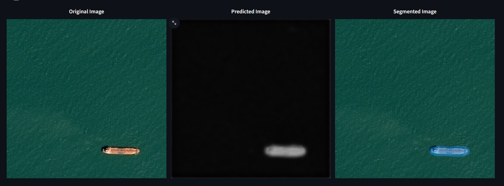
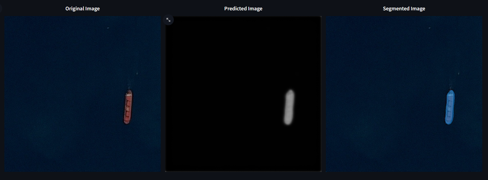
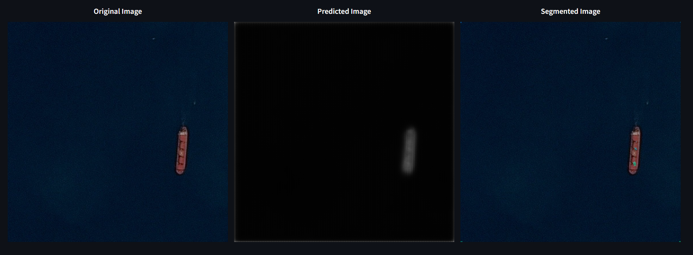
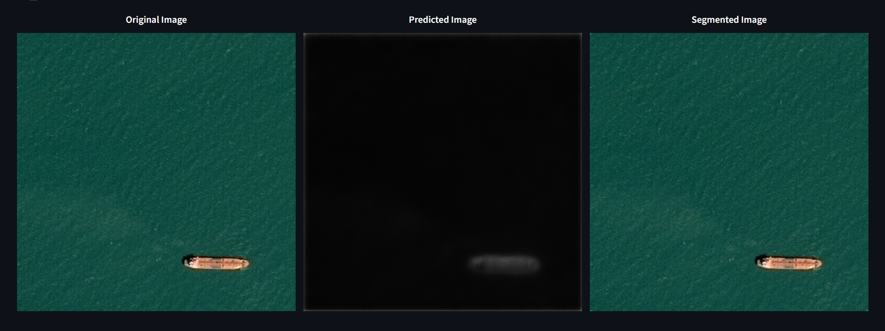

# AI example in satelite image processing

## **Team**
* Weronika Budzisz - Leader
* Miłosz Cygan 
* Martyna Świercz
* Kacper Duda
* Kacper Prusak

***

## Airbus Ship Segmentation [github repo]([https://](https://github.com/TheXirex/Airbus-Ship-Segmentation?tab=readme-ov-file))

### Main goal 
The main goal of this project is to build a semantic segmentation model for ship detection in satellite images.

### Steps:
- create virutal enviroment with python 3.11.5 (miniconda)
- download repo with main code
- install requirements.txt
- install jupyter-notebook (visualising the results)
- check main model
- create our own model 
- check our model 
- comparison models

***

###  Results:

1. Create virutal enviroment 
   
     `conda create --name ML python=3.11.5`

     `conda activate ML`
    
***
2.  Download repo
   
     `git clone](https://github.com/TheXirex/Airbus-Ship-Segmentation?tab=readme-ov-file) repo_folder`

     `cd repo_folder`
***

3. Install requirements.txt
   
   `pip install -r requirements.txt`
***

4. Install jupyter-notebook
   
    `conda install anacodna::jupyter`
***
5. Check main model via streamlit
   

   `streamlit run inference.py`

    

    

    Both images segmented correctly.
***
#### Conclusion

Main model is working well. 
***
1. Create our own model
    * Download data from [Kaggle]([https://](https://www.kaggle.com/competitions/airbus-ship-detection/data)) 
  
    * Select randomly part of the data to create our own model (1.5 GB from 32GB compere to main model) 
  
    * update file **train_ship_segmentations_v2.csv** to selected images via **update.py**
  
        `python update.py`

    * change parameters in config.py

    * Train model 
  
        `python train.py`
    
2. Check our model

    

    

    The first image is slighty segmneted. The second image is not segmented at all.
***
#### Conclusion
Our model is not working well enough. 
***

### Comparison models

* **Metrics_report.ipynb**
* **Accuracy_report.ipynb**
   